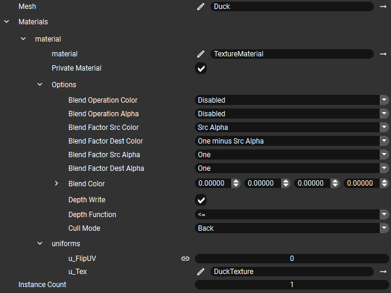

<!--
SPDX-License-Identifier: MPL-2.0

This file is part of Ramses Composer
(see https://github.com/bmwcarit/ramses-composer-docs).

This Source Code Form is subject to the terms of the Mozilla Public License, v. 2.0.
If a copy of the MPL was not distributed with this file, You can obtain one at http://mozilla.org/MPL/2.0/.
-->

# BlitPass example
*You can find the example project [here](https://github.com/bmwcarit/ramses-composer-docs/tree/master/doc/basics/blitpass).*

This example shows how to use `BlitPass` render pass to perform copy between render buffers with the Ramses Composer.

In OpenGL, [blitting](https://www.khronos.org/opengl/wiki/Framebuffer#Blitting) is an efficient operation to copy rectangular regions between FBOs (represented in Ramses Composer by `RenderTargets`). It allows to re-use already rendered buffers containing color, depth or other data format in subsequent render passes.

Similarly to the [offscreen rendering example](../offscreen/README.md), this example renders to a texture first. Then it blits color render buffer region to another render buffer four times to create a tiled image. Finally, it renders both render buffers contents on quads, as well as original mesh, to the framebuffer.

## Scene graph and resources

Firstly, the scene is set up. It contains:

* Two meshes: a duck and a quad
* A `DuckMeshNode`, `QuadMeshNodeLeft` and `QuadMeshNodeRight` build up the scene
* Two cameras: a `DuckCamera` used for offscreen rendering of the duck front, and the default `PerspectiveCamera` for the final scene

All meshes are rendered using `TextureMaterial`. Note that in each `MeshNode` a Private Material is defined to specify the texture source and UV-flipping. Quad meshes are exported from Blender and require to flip the V coordinate.

## Offscreen rendering

Secondly, offscreen rendering with `DuckRenderPass` to `DuckRenderBuffer` is set up:

* `DuckRenderBuffer` with `RGBA8` color format and `DuckDepthRenderBuffer` with `Depth24` format are created. They are set to `DuckRenderTarget`. Binding the depth buffer to the render target allows depth-testing.
* `DuckRenderLayer` is created with Renderable Tags set to `duck`, the tag assigned also to `DuckMeshNode` mesh.
* `DuckRenderPass` is created, specifying rendering of `DuckRenderLayer` nodes using `DuckCamera` to `DuckRenderTarget`.
* RenderOrder property of `DuckRenderPass` is set to 0: it draws to `DuckRenderTarget` buffers before MainRenderPass reads `DuckRenderBuffer` as texture for quads. Clear Color property is set to some sort of green.

## BlitPass

Next, `BlitPasses` are created. Four `BlitPass` instances are defined. Each blits pixel region with duck's head from `DuckRenderBuffer` to `BlitRenderBuffer` four times.

* As blit destination, `BlitRenderBuffer` is created. Its dimensions must match source dimensions.
* `BlitPass` with Source Render Buffer as `DuckRenderBuffer` and Target Render Buffer as `BlitRenderBuffer` are created.
* Note that source and destination render buffers must have same dimensions and format. They must be different render buffers.
* Buffer Offset and Blitting Region dimensions specify the rectangular area to be copied.
* RenderOrder of `BlitPass` is set to 1: it must be executed after `DuckRenderPass`.

After creating and setting up the first `BlitPass`, Duplicate (Ctrl+D) command can be used to create three more copies. Blit regions are then specified individually.

Note that all `BlitPasses` have same RenderOrder. Ramses Composer informs user that their execution order is undefined (as seen on screenshot). In this example, the execution order does not matter: there is no mutual dependency between `BlitPasses`.

## Displaying offscreen buffers contents

Finally, to visualize both blit source, `DuckRenderBuffer` and destination, `BlitRenderBuffer`, they are set as texture uniforms `u_Tex` in left and right `QuadMeshNodes`, similarly as in aforementioned [offscreen rendering example](../offscreen/README.md). Note that `u_FlipUV` attribute is set to 1, because the `Quad` mesh has V coordinate flipped.

`MainRenderLayer` Renderable Tags are set to `render_main` (for rendering quads) and `duck` to display original duck mesh side view rendered with default `PerspectiveCamera`.

`MainRenderPass` Render Order is set to 3: it is must be executed last, after `DuckRenderPass` and all `BlitPasses`, because it depends on their output render buffers.